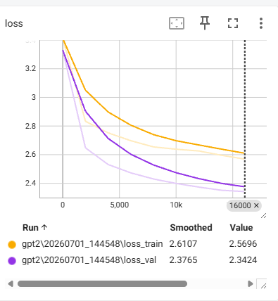
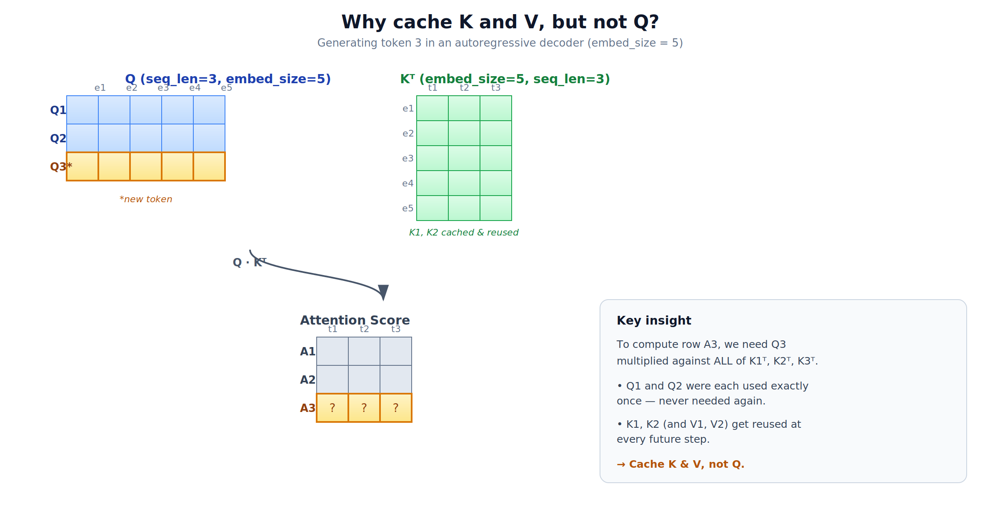
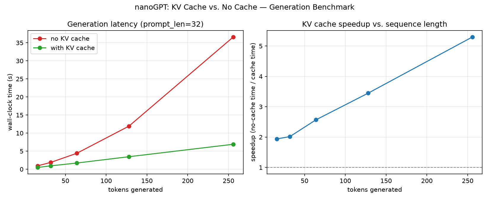
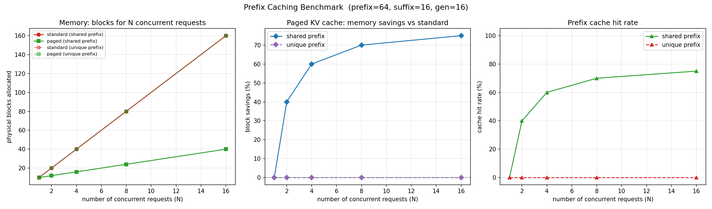

# nanoGPT

A hands-on implementation of GPT-style models from first principles, designed for learning, experimentation, and practical fine-tuning. This project covers the full journey from custom tokenizer design and transformer internals to training and inference adaptation of GPT-2.

---

## Key Features

- **Models from Scratch**: Implemented a hierarchy of generative models including a simple [Bigram](file:///Users/lhhmmiii/Documents/PersonalProjects/nanoGPT/models/bigram.py#L6), a basic [GPT1](file:///Users/lhhmmiii/Documents/PersonalProjects/nanoGPT/models/gpt1.py#L9), and a full [GPT2](file:///Users/lhhmmiii/Documents/PersonalProjects/nanoGPT/models/gpt2.py#L119) architecture.
- **Custom Tokenizers**: Developed from-scratch tokenization strategies, including character-level and Byte Pair Encoding (BPE) systems.
- **End-to-End Pipeline**: Created robust pipelines for data preparation, dataset class mapping, training loops, tensorboard logging, and checkpoints.
- **KV Cache Optimizations**: Implemented KV cache management inside attention layers to significantly speed up autoregressive decoding.
- **Paged Attention**: Added a memory management layer that partitions the KV cache into fixed-size blocks using a block allocator with prefix caching, minimizing fragmentation and enabling cache reuse across requests that share a prompt prefix.

---

## Repository Structure

```
├── README.md                           # Project overview and documentation
├── requirements.txt                    # Project dependencies
├── prepare_data.py                     # Script to tokenize and save datasets
├── dataset.py                          # Custom PyTorch Dataset wrapping binary token files
├── train_gpt2.py                       # GPT-2 training and fine-tuning loop
├── benchmark_kv_cache.py               # KV cache benchmark and plotting utility
├── benchmark_prefix_caching.py         # Prefix-caching memory savings benchmark for paged attention
├── assests/                            # Visual assets (loss curves, benchmarks, diagrams)
├── tokenization/                       # Custom tokenizer module
│   ├── base.py                         # Abstract base class for tokenizers
│   ├── character.py                    # Simple character-level tokenizer
│   └── bpe.py                          # Custom Byte Pair Encoding (BPE) implementation
├── models/                             # Model architectures
│   ├── bigram.py                       # Baseline Bigram Language Model
│   ├── gpt1.py                         # GPT-1 architecture (post-norm style)
│   ├── gpt2.py                         # GPT-2 architecture (pre-norm, with KV caching)
│   └── gpt2_paged.py                   # Paged Attention variant of GPT-2
├── paged_attention/                    # Paged Attention memory subsystem
│   ├── kv_cache_manager.py             # Logical block allocator, LRU free list & prefix-cache hash map
│   └── kv_cache_tensor.py              # Physical KV storage tensor (per-layer block read/write)
├── schemas/                            # Data transfer and structural models
│   └── request_schema.py               # Request and LogicalBlock dataclasses
├── utils/                              # Shared helpers
│   └── block.py                        # Block hashing, logical block construction (prefill/decode)
└── tests/                              # Pytest unit tests for GPT-2 and the paged attention subsystem
```

---

## Architectural Breakdown

### 1. Custom Tokenization
The [tokenization](file:///Users/lhhmmiii/Documents/PersonalProjects/nanoGPT/tokenization) package implements the preprocessing layer:
- **[BaseTokenizer](file:///Users/lhhmmiii/Documents/PersonalProjects/nanoGPT/tokenization/base.py#L3)**: Defines a unified abstract interface for training, encoding, decoding, saving, and loading vocabularies.
- **[CharacterTokenizer](file:///Users/lhhmmiii/Documents/PersonalProjects/nanoGPT/tokenization/character.py#L5)**: Maps each character to a unique integer ID.
- **[BPETokenizer](file:///Users/lhhmmiii/Documents/PersonalProjects/nanoGPT/tokenization/bpe.py#L6)**: A custom implementation of Byte Pair Encoding. It encodes text as UTF-8 bytes and iteratively merges the most frequent pairs up to a configured vocabulary size.

### 2. Model
The [models](file:///Users/lhhmmiii/Documents/PersonalProjects/nanoGPT/models) package houses the neural architectures:
- **[Bigram](file:///Users/lhhmmiii/Documents/PersonalProjects/nanoGPT/models/bigram.py#L6)**: A simple lookup model predicting the next token based only on the current token.
- **[GPT1](file:///Users/lhhmmiii/Documents/PersonalProjects/nanoGPT/models/gpt1.py#L9)**: Implementation of the original GPT paper featuring learned positional embeddings, multi-head attention, and post-layer normalization.
- **[GPT2](file:///Users/lhhmmiii/Documents/PersonalProjects/nanoGPT/models/gpt2.py#L119)**: The modern standard featuring pre-layer normalization, scaled residual initializations, optional bias flags, and support for loading HuggingFace OpenAI weights (`gpt2`, `gpt2-medium`, `gpt2-large`, `gpt2-xl`).

---

## GPT-2 Fine-Tuning

A fine-tuning run was executed on the WikiText-103 dataset, which contains ~109 million tokens. The model was fine-tuned to study convergence behavior.



### Experiment Insights:
- Stable optimization trajectory with a steady cross-entropy loss reduction.
- Practical end-to-end workflow validating checkpoint loading via the `load_checkpoint` utility.
- Solid basis for domain-specific downstream tasks.

---

## Inference Optimizations

Autoregressive decoding generates tokens sequentially. Processing the entire sequence at each step is computationally expensive ($O(N^2)$ attention computations).

### 1. KV Caching
We optimize this by caching the Key and Value states of previous tokens in the [CausalSelfAttention](file:///Users/lhhmmiii/Documents/PersonalProjects/nanoGPT/models/gpt2.py#L30) layers. During each generation step, only the new token is fed into the model.

#### Why cache K and V — but not Q?
Suppose $Q$ and $K$ both have shape `(seq_len, embed_size)`. The attention score is computed as $Q \cdot K^T$.



Consider the step where we generate the 3rd token:
- To compute the attention scores for the new token ($A_3$), we only need $Q_3$ multiplied against all past keys $K_1^T, K_2^T, K_3^T$.
- $Q_1$ and $Q_2$ are never reused after their initial generation steps.
- Conversely, $K_1, K_2$ (and $V_1, V_2$) are reused at every future step, since each new query must attend to all past tokens.
- Therefore, caching past queries yields no performance benefit. Caching past keys and values eliminates redundant computations.

#### KV Cache Speedup Benchmark
A benchmark was run comparing generation performance with and without KV caching (configured with a prompt length of 32 tokens on CPU):



Key observations:
- A significant reduction in generation latency, scaling from a **2x speedup** for short sequences to over **5.7x speedup** for 256 tokens.
- Attention computation achieves near constant-time complexity per token with the cache, avoiding the quadratic scaling without it.

---

## Paged Attention

For longer sequences or concurrent requests, pre-allocating contiguous KV cache buffers leads to severe memory fragmentation (both internal and external) and over-allocation (reserving space for max sequence lengths).

Inspired by virtual memory paging in operating systems, this project implements a Paged Attention framework under the [paged_attention](file:///Users/lhhmmiii/Documents/PersonalProjects/nanoGPT/paged_attention) module to manage KV cache memory in fixed-size, non-contiguous blocks.

### Implementation Details

1. **Request & Logical Blocks**:
   - **[Request](file:///Users/lhhmmiii/Documents/PersonalProjects/nanoGPT/schemas/request_schema.py#L11)**: Tracks a generation request's input/generated token ids, its ordered list of [LogicalBlock](file:///Users/lhhmmiii/Documents/PersonalProjects/nanoGPT/schemas/request_schema.py#L5) entries, and `num_computed_tokens` (how many tokens already have KV entries cached).
   - **[build_logical_blocks()](file:///Users/lhhmmiii/Documents/PersonalProjects/nanoGPT/utils/block.py#L33)**: Splits a request's prompt into fixed-size logical blocks during the prefill phase, computing a chained SHA-256 hash for every *full* block so it can participate in prefix caching.
   - **[append_decode_token()](file:///Users/lhhmmiii/Documents/PersonalProjects/nanoGPT/utils/block.py#L69)**: During decoding, appends each newly generated token to the last logical block, creating a new block once the previous one fills up and computing its hash at that point.

2. **Block Allocation & Eviction**:
   - **[KVCacheBlock](file:///Users/lhhmmiii/Documents/PersonalProjects/nanoGPT/paged_attention/kv_cache_manager.py#L10)**: Represents a physical block, trackable by ID, usage reference count (`ref_cnt`), and cache hash signature.
   - **[KVCacheManager](file:///Users/lhhmmiii/Documents/PersonalProjects/nanoGPT/paged_attention/kv_cache_manager.py#L23)**: Manages allocation and eviction. It uses a **doubly-linked free list** representing a Least Recently Used (LRU) policy. When a request requires a block, the manager pops it from the head. When a block's reference count falls to 0, it is appended back to the tail of the free list. `allocate()` assigns physical blocks to all unassigned logical blocks of a request (prefill), while `allocate_last_block()` assigns a physical block to the newly created partial block during decode.
   - **Prefix Caching**: The manager maps block hash signatures to allocated blocks in `cached_blocks`. If a new request's block hash already exists, it's a cache hit — the manager reuses the existing physical block and increments its `ref_cnt` instead of allocating a new one.

3. **Physical Storage**:
   - **[KVCacheTensor](file:///Users/lhhmmiii/Documents/PersonalProjects/nanoGPT/paged_attention/kv_cache_tensor.py#L3)** pre-allocates a single contiguous tensor of shape `[n_layer, 2, num_blocks, n_head, kv_block_size, head_dim]`. `read_block()`/`write_block()` index into an individual layer's physical block by id and token offset.

4. **Paged GPT-2**:
   - **[GPT2 (paged)](file:///Users/lhhmmiii/Documents/PersonalProjects/nanoGPT/models/gpt2_paged.py#L271)** mirrors the standard [GPT2](file:///Users/lhhmmiii/Documents/PersonalProjects/nanoGPT/models/gpt2.py#L119) architecture, but its [CausalSelfAttention](file:///Users/lhhmmiii/Documents/PersonalProjects/nanoGPT/models/gpt2_paged.py#L38) gathers past K/V from the `KVCacheTensor` via each request's logical→physical block mapping before attending, and writes newly computed K/V back into the same blocks.
   - **[generate_with_cache()](file:///Users/lhhmmiii/Documents/PersonalProjects/nanoGPT/models/gpt2_paged.py#L508)** drives prefill (build logical blocks → allocate → forward) and decode (append token → allocate last block → forward one token at a time) for a single `Request`, freeing its blocks back to the `KVCacheManager` once generation finishes.

### Prefix Caching Benchmark

[benchmark_prefix_caching.py](file:///Users/lhhmmiii/Documents/PersonalProjects/nanoGPT/benchmark_prefix_caching.py) compares physical block usage between the standard and paged KV caches when N concurrent requests share a 64-token prefix with a 16-token unique suffix, against a control group of requests with no shared prefix:



Key observations:
- With a shared prefix, paged attention deduplicates the common blocks via prefix-hash lookups, saving up to **75% of allocated blocks** at 16 concurrent requests (40 blocks vs. 160 for the standard cache).
- With unique prefixes (control group), there's nothing to deduplicate, so paged and standard caches allocate the same number of blocks (0% savings).

---

## Quick Start

### 1. Setup Environment

Install dependencies listed in [requirements.txt](file:///Users/lhhmmiii/Documents/PersonalProjects/nanoGPT/requirements.txt):

```bash
pip install -r requirements.txt
```

### 2. Dataset Preparation

Download and extract the WikiText-103 dataset, placing the text files in `data/wikitext-103/`. Then tokenise the corpus into binary files using Tiktoken's GPT-2 BPE configuration:

```bash
python prepare_data.py
```

### 3. Model Training

Run the training or fine-tuning script. The hyperparameters, network setup, and logging options are fully configurable inside [train_gpt2.py](file:///Users/lhhmmiii/Documents/PersonalProjects/nanoGPT/train_gpt2.py):

```bash
python train_gpt2.py
```

### 4. Running Benchmarks

Compare the latency of autoregressive generation with and without the KV Cache optimization:

```bash
python benchmark_kv_cache.py
```

Measure the block-level memory savings prefix caching gives concurrent requests that share a prompt:

```bash
python benchmark_prefix_caching.py
```

### 5. Running Tests

Unit tests cover GPT-2 and the paged attention block allocator:

```bash
pytest
```

---

## Sources / Inspiration

- **Andrej Karpathy**: *Let's reproduce GPT-2 (124M)* ([YouTube Lecture](https://www.youtube.com/watch?v=l8pRSuU81PU)) and *Let's build the GPT Tokenizer* ([YouTube Lecture](https://www.youtube.com/watch?v=zduSFxRajkE))
- **vLLM Team**: *PagedAttention* research paper ([arXiv:2309.06180](https://arxiv.org/pdf/2309.06180))
