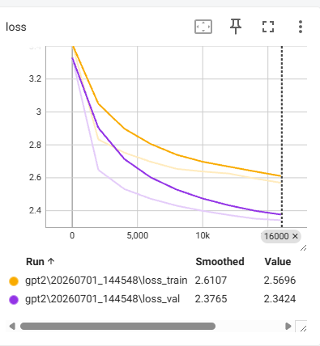
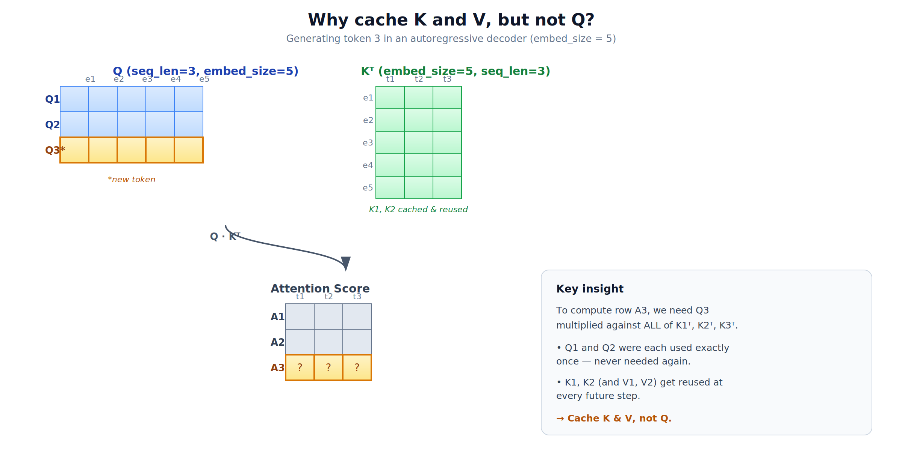
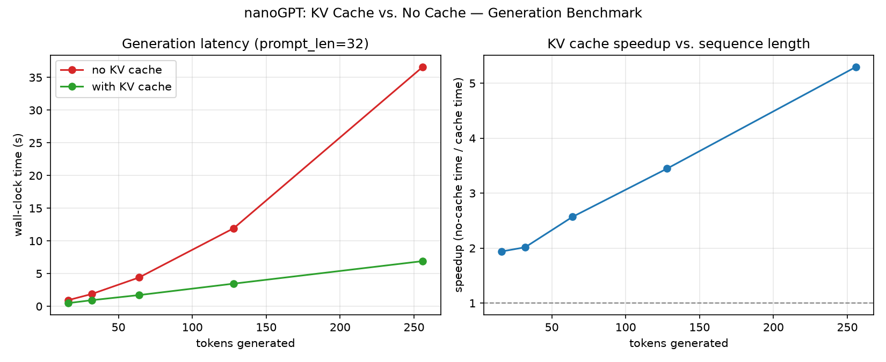
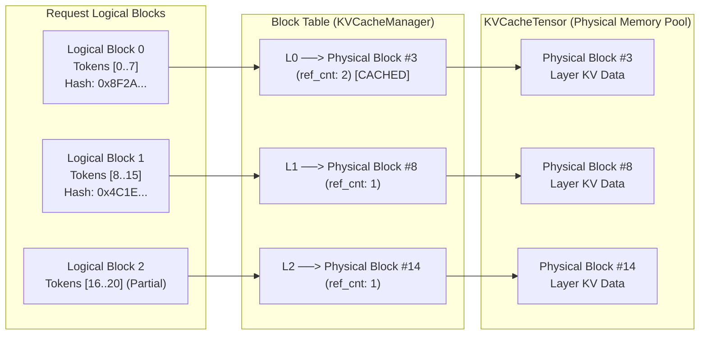
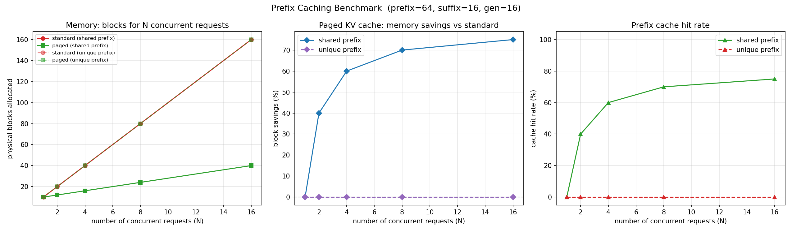

<div align="center">

# ⚡ nanoGPT
### From First Principles to Paged Attention & Full-Stack Real-Time Serving

[](https://www.python.org/)
[](https://pytorch.org/)
[](https://fastapi.tiangolo.com/)
[](https://react.dev/)
[](https://vitejs.dev/)
[](https://tailwindcss.com/)
[](LICENSE)

<p align="center">
  <b>A comprehensive, ground-up implementation of generative Transformer language models.</b><br>
  Covers custom byte-level tokenization, pre/post-norm architectures, Hugging Face weight loading, WikiText-103 fine-tuning, KV cache acceleration, vLLM-inspired <b>Paged Attention with Prefix Caching</b>, an asynchronous <b>FastAPI SSE backend</b>, and an interactive <b>React Chat UI</b>.
</p>

[Key Features](#-key-features) •
[Model Evolution](#️-model-evolution--comparison) •
[Architecture](#️-system-architecture--data-flow) •
[Inference Optimizations](#-inference-optimizations) •
[Paged Attention](#-paged-attention--prefix-caching) •
[Full-Stack Serving](#-full-stack-serving--web-ui) •
[Quick Start](#-quick-start)

---

</div>

## 🌟 Key Features

- **🧱 Models from First Principles**:
  - **Bigram**: Baseline statistical n-gram model.
  - **GPT-1**: Post-Layer Normalization architecture with learned positional embeddings.
  - **GPT-2**: Modern Pre-Layer Normalization architecture with scaled residual projections, FlashAttention support, and Hugging Face checkpoint weights import (`gpt2`, `gpt2-medium`, `gpt2-large`, `gpt2-xl`).
- **🔤 Custom Tokenization Engine**:
  - Abstract tokenizer interface (`BaseTokenizer`).
  - Character-level encoder/decoder.
  - Custom **Byte Pair Encoding (BPE)** engine operating directly on raw UTF-8 byte streams with iterative pair-merge training and regex split pattern matching.
- **🚀 Advanced Inference Optimizations**:
  - **Standard KV Caching**: Eliminates redundant $O(N^2)$ prefix recomputation during autoregressive generation to achieve near $O(1)$ constant-time generation steps (**up to 5.7× speedup**).
  - **Paged Attention Subsystem**: OS-inspired virtual memory paging for KV tensors that eliminates internal/external fragmentation.
  - **Chained Hash Prefix Caching**: Deterministic SHA-256 block hashing that automatically deduplicates shared prompt prefixes across concurrent requests (**up to 75% memory savings**).
- **🌐 Full-Stack Production Serving**:
  - **FastAPI Engine**: Asynchronous inference server supporting standard non-blocking endpoints (`POST /api/chat`) and Server-Sent Events (SSE) token streaming (`GET /api/chat/stream`).
  - **Interactive React UI**: Clean, responsive chat interface built with Vite, Tailwind CSS, Lucide icons, Markdown rendering, and real-time generation controls (temperature, top-$k$, max tokens).
- **🧪 Comprehensive Test Suite**:
  - Unit tests covering BPE tokenization, transformer forward passes, KV cache parity, LRU block management, and prefix deduplication.

---

## 🏛️ Model Evolution & Comparison

| Feature / Property | [Bigram](models/bigram.py) | [GPT-1](models/gpt1.py) | [GPT-2](models/gpt2.py) | [GPT-2 (Paged)](models/gpt2_paged.py) |
| :--- | :--- | :--- | :--- | :--- |
| **Attention Mechanism** | None | Multi-Head Causal Self-Attention | Multi-Head Causal Self-Attention | Paged Multi-Head Attention |
| **Layer Normalization** | None | Post-LayerNorm | Pre-LayerNorm | Pre-LayerNorm |
| **Positional Encoding** | None | Learned 1D Embeddings | Learned 1D Embeddings | Learned 1D Embeddings |
| **Residual Scaling** | None | Standard | $1 / \sqrt{2 \times N_{\text{layer}}}$ | $1 / \sqrt{2 \times N_{\text{layer}}}$ |
| **Pretrained Weights** | ❌ | ❌ | ✅ Hugging Face (124M-1.5B) | ✅ Hugging Face (124M-1.5B) |
| **KV Cache Support** | ❌ | ❌ | ✅ Contiguous Tensor | ✅ Non-contiguous Block Tensor |
| **Prefix Caching** | ❌ | ❌ | ❌ | ✅ Chained SHA-256 Deduplication |

---

## 📂 Repository Structure

```
.
├── api/                               # FastAPI serving backend
│   ├── main.py                        # Application entrypoint & lifespan management
│   ├── config.py                      # Server and inference configuration
│   ├── router.py                      # API endpoints (health, chat, SSE stream)
│   ├── schemas.py                     # Request/Response Pydantic validation models
│   └── inference.py                   # InferenceEngine singleton & generation loops
├── frontend/                          # Interactive React chat client
│   ├── src/
│   │   ├── App.jsx                    # Root application component
│   │   ├── components/                # UI components (ChatWindow, MessageInput, Sidebar)
│   │   └── hooks/                     # Custom React hooks (SSE streaming integration)
│   ├── package.json                   # Frontend dependencies
│   ├── tailwind.config.js             # Tailwind CSS configuration
│   └── vite.config.js                 # Vite bundler configuration
├── tokenization/                      # Custom tokenization engines
│   ├── base.py                        # Abstract base tokenizer interface
│   ├── character.py                   # Character-level tokenizer implementation
│   └── bpe.py                         # Byte Pair Encoding (BPE) from scratch
├── models/                            # Neural model architectures
│   ├── bigram.py                      # Baseline Bigram language model
│   ├── gpt1.py                        # GPT-1 architecture (Post-LN)
│   ├── gpt2.py                        # GPT-2 architecture (Pre-LN, standard KV cache)
│   └── gpt2_paged.py                  # Paged Attention variant of GPT-2
├── paged_attention/                   # Paged attention memory subsystem
│   ├── kv_cache_manager.py            # Physical block allocator, LRU free list & hash map
│   └── kv_cache_tensor.py             # Pre-allocated physical KV storage tensor
├── schemas/                           # Internal data structures
│   └── request_schema.py              # Request and LogicalBlock dataclasses
├── utils/                             # Shared utility functions
│   └── block.py                       # Chained SHA-256 block hashing and sequence chunking
├── tests/                             # Pytest test suite
│   ├── test_gpt2.py                   # GPT-2 model tests
│   ├── test_block_utils.py            # Block hashing and chunking tests
│   ├── test_kv_cache_manager.py       # Allocation, eviction & LRU tests
│   └── test_gpt2_paged_attention.py   # Paged attention end-to-end parity tests
├── assests/                           # Benchmark charts and architecture diagrams
├── prepare_data.py                    # Tokenization and binary dataset export script
├── dataset.py                         # Memory-mapped binary token dataset loader
├── train_gpt2.py                      # Training loop with cosine LR and checkpointing
├── benchmark_kv_cache.py              # KV cache latency benchmark tool
├── benchmark_prefix_caching.py        # Prefix caching memory savings benchmark tool
└── requirements.txt                   # Python project dependencies
```

---

## 🔬 Deep-Dive: Architectural Components

### 1. Custom Tokenization Engine

The [`tokenization`](tokenization) module provides modular text-to-token pipelines:

- **[`BaseTokenizer`](tokenization/base.py)**: Establishes a contract for `train()`, `encode()`, `decode()`, `save()`, and `load()`.
- **[`CharacterTokenizer`](tokenization/character.py)**: Deterministic character-to-integer mapping for lightweight prototyping.
- **[`BPETokenizer`](tokenization/bpe.py)**: Full Byte Pair Encoding implementation:
  - Operates directly on raw UTF-8 byte sequences.
  - Implements the GPT-2 regular expression splitting pattern to prevent merges across whitespace and punctuation boundaries.
  - Iteratively identifies the most frequent consecutive byte pair and merges them into new token IDs until reaching the target vocabulary size.

### 2. Transformer Architectures

Implemented in [`models`](models) from clean mathematical definitions:

```
GPT-1 (Post-LN):   x -> [ SubLayer(x) ] -> [ LayerNorm(x + SubLayer(x)) ]
GPT-2 (Pre-LN):    x -> [ SubLayer(LayerNorm(x)) ] -> x + SubLayer(LayerNorm(x))
```

- **Pre-Layer Normalization**: Stabilizes activations and gradient flow through deep stacks of transformer blocks.
- **Residual Projection Scaling**: All residual projection layers (`c_proj`) are initialized with std $\sigma = \frac{0.02}{\sqrt{2 \times N_{\text{layer}}}}$ to prevent activation variance explosion at initialization.
- **Hugging Face Checkpoint Portability**: `GPT2.from_pretrained(model_type)` maps OpenAI/Hugging Face checkpoint weights directly into our custom architecture, transposing Conv1D linear weights to PyTorch standard linear conventions.

---

## 📈 Model Training & Fine-Tuning

The project includes an end-to-end training pipeline targeting large-scale corpora like **WikiText-103** (~109M tokens):

- **Data Serialization**: Tokenized into compact binary uint16 buffers for high-throughput memory-mapped loading via [`dataset.py`](dataset.py).
- **Optimization Strategy**: AdamW optimizer with $\beta_1=0.9, \beta_2=0.95$, weight decay of $0.1$, gradient norm clipping at $1.0$, and a **Cosine Annealing Learning Rate Schedule** with linear warmup.
- **Validation & Checkpointing**: Automatic best-model checkpoint saving with full optimizer state tracking.

<div align="center">
  
  <p><i>Figure 1: Fine-tuning loss trajectory demonstrating smooth convergence on WikiText-103.</i></p>
</div>

---

## ⚡ Inference Optimizations

Autoregressive decoding generates tokens sequentially $x_{t+1} \sim P(x_{t+1} \mid x_1, \dots, x_t)$. Without optimization, every step recomputes attention across the entire historical sequence, resulting in quadratic $O(N^2)$ computational complexity.

### 1. KV Caching

In self-attention, the attention matrix is computed as:

$$\text{Attention}(Q, K, V) = \text{softmax}\left(\frac{Q K^T}{\sqrt{d_k}}\right) V$$

#### Why cache $K$ and $V$, but not $Q$?
When generating token $t+1$:
- We only need the query vector of the *new token* ($Q_{t+1}$) to compute its attention scores against all past positions ($K_1, \dots, K_{t+1}$).
- Past query vectors ($Q_1, \dots, Q_t$) are **never accessed again**.
- Past keys ($K$) and values ($V$) are required by every future generation step. Caching them reduces each decoding step from $O(t)$ to $O(1)$ attention computations.

<div align="center">
  
  <p><i>Figure 2: Attention computation breakdown showing why past K and V are cached while Q is ephemeral.</i></p>
</div>

#### Latency Benchmark Results

Running autoregressive generation on CPU across varying sequence lengths:

<div align="center">
  
  <p><i>Figure 3: Generation time comparison with and without KV Cache.</i></p>
</div>

| Generated Tokens | Naive Time (s) | KV Cache Time (s) | **Speedup** |
| :---: | :---: | :---: | :---: |
| **32** | 0.42s | 0.21s | **2.0×** |
| **64** | 1.15s | 0.41s | **2.8×** |
| **128** | 3.24s | 0.82s | **4.0×** |
| **256** | 9.48s | 1.66s | **5.7×** |

---

## 🧩 Paged Attention & Prefix Caching

### The Problem: Contiguous Memory Inefficiency
Standard KV caching allocates static, contiguous tensors per request up to `max_seq_len`. This causes:
1. **Internal Fragmentation**: Unused reserved slots in pre-allocated buffers.
2. **External Fragmentation**: Memory allocators cannot satisfy new requests despite having sufficient total free memory.
3. **Redundant Storage**: Concurrent requests sharing prompts (system prompts, few-shot examples) duplicate identical KV entries.

### The Solution: Paged Memory & Block Management

Inspired by operating system virtual memory, Paged Attention splits the KV cache into fixed-size physical blocks (e.g., `block_size = 8` tokens):


```mermaid
graph LR
    subgraph Request["Request Logical Blocks"]
        L0["Logical Block 0<br/>Tokens [0..7]<br/>Hash: 0x8F2A..."]
        L1["Logical Block 1<br/>Tokens [8..15]<br/>Hash: 0x4C1E..."]
        L2["Logical Block 2<br/>Tokens [16..20] (Partial)"]
    end

    subgraph Manager["Block Table (KVCacheManager)"]
        M0["L0 ──> Physical Block #3 (ref_cnt: 2) [CACHED]"]
        M1["L1 ──> Physical Block #8 (ref_cnt: 1)"]
        M2["L2 ──> Physical Block #14 (ref_cnt: 1)"]
    end

    subgraph TensorPool["KVCacheTensor (Physical Memory Pool)"]
        P3["Physical Block #3<br/>Layer KV Data"]
        P8["Physical Block #8<br/>Layer KV Data"]
        P14["Physical Block #14<br/>Layer KV Data"]
    end

    L0 --> M0 --> P3
    L1 --> M1 --> P8
    L2 --> M2 --> P14
```

1. **[`LogicalBlock`](schemas/request_schema.py)**: Tracks token chunks and computes a **chained SHA-256 hash**:
   $\text{Hash}_i = \text{SHA256}(\text{Hash}_{i-1} \,\|\, \text{tokens}_i)$
2. **[`KVCacheManager`](paged_attention/kv_cache_manager.py)**:
   - **Doubly-Linked Free List**: Implements an LRU (Least Recently Used) physical block eviction/allocation policy.
   - **Prefix Cache Hash Map**: Maps block hashes to active physical blocks. When a new request shares a prompt prefix with an existing block, it increments `ref_cnt` and shares the physical block.
3. **[`KVCacheTensor`](paged_attention/kv_cache_tensor.py)**:
   - Pre-allocates a unified memory tensor with shape:
     $$\left[N_{\text{layer}}, 2, N_{\text{blocks}}, N_{\text{head}}, \text{BlockSize}, D_{\text{head}}\right]$$
4. **[`GPT2 (Paged)`](models/gpt2_paged.py)**:
   - Attention layers gather non-contiguous physical blocks via block lookup tables during attention and write new tokens into allocated block offsets.

### Prefix Caching Benchmark

Benchmarking memory allocation under $N$ concurrent requests sharing a 64-token prefix with a 16-token unique suffix:

<div align="center">
  
  <p><i>Figure 4: Physical memory savings achieved via prefix hash deduplication.</i></p>
</div>

> [!TIP]
> **Key Benchmark Takeaway**: At 16 concurrent requests sharing a prefix, Paged Attention reduces total allocated blocks from **160 blocks down to 40 blocks** — achieving an instantaneous **75% memory reduction**.

---

## 🌐 Full-Stack Serving & Web UI

This project includes a complete, modern serving stack ready for local deployment and experimentation:

### 1. Asynchronous FastAPI Backend ([`api/`](api))
- **Singleton Engine Lifecycle**: Eagerly loads model weights and pre-allocates KV block pools on startup via FastAPI `lifespan`.
- **Streaming Generation**: Low-latency token-by-token output using Server-Sent Events (`SSE`).
- **Memory Introspection**: `/api/health` reports live physical KV block utilization and allocator state.

#### API Endpoints
- `GET /api/health` — Check server health, model device, and available free KV blocks.
- `POST /api/chat` — Synchronous full-text completion.
- `GET /api/chat/stream` — Real-time Server-Sent Events (SSE) streaming.

### 2. Modern React Chat UI ([`frontend/`](frontend))
- Built with **React 18**, **Vite**, and **Tailwind CSS**.
- **Interactive Control Drawer**: Live tuning of `Temperature`, `Top-K`, and `Max Tokens`.
- **Markdown & Code Highlighting**: Formatted rendering of model responses.
- **Stream Controls**: Real-time response streaming with abort/cancel support.

---

## 🚀 Quick Start

### 1. Clone & Install Dependencies

```bash
# Clone the repository
git clone https://github.com/your-username/nanoGPT.git
cd nanoGPT

# Set up Python virtual environment
python3 -m venv venv
source venv/bin/activate

# Install Python packages
pip install -r requirements.txt
```

### 2. Dataset Preparation & Training

```bash
# Prepare WikiText-103 dataset (or your custom corpus)
python prepare_data.py

# Train / Fine-tune GPT-2
python train_gpt2.py
```

### 3. Run Benchmarks

```bash
# Run the KV Cache latency speedup benchmark
python benchmark_kv_cache.py

# Run the Paged Attention prefix caching memory benchmark
python benchmark_prefix_caching.py
```

### 4. Launch Full-Stack Web Application

#### Start Backend Server:
```bash
uvicorn api.main:app --host 0.0.0.0 --port 8000 --reload
```

#### Start Frontend Client:
```bash
cd frontend
npm install
npm run dev
```

Open your browser at `http://localhost:5173` to start chatting with your model!

### 5. Running Tests

```bash
pytest tests/ -v
```

---

## ⚙️ Configuration Options

Server and inference parameters can be customized via environment variables:

| Variable | Default | Description |
| :--- | :---: | :--- |
| `MODEL_TYPE` | `gpt2` | Model variant (`gpt2`, `gpt2-medium`, `gpt2-large`, `gpt2-xl`) |
| `CHECKPOINT_PATH` | `None` | Path to custom fine-tuned `.pt` checkpoint file |
| `NUM_KV_BLOCKS` | `512` | Total number of physical KV cache blocks allocated |
| `DEFAULT_MAX_NEW_TOKENS` | `100` | Default generation length limit |
| `DEFAULT_TEMPERATURE` | `0.7` | Sampling temperature for randomness |
| `DEFAULT_TOP_K` | `50` | Top-$k$ filtering threshold |
| `API_HOST` | `0.0.0.0` | API bind host address |
| `API_PORT` | `8000` | API bind port |

---

## 📚 References & Inspiration

- **Andrej Karpathy**: [*Let's reproduce GPT-2 (124M)*](https://www.youtube.com/watch?v=l8pRSuU81PU) & [*Let's build the GPT Tokenizer*](https://www.youtube.com/watch?v=zduSFxRajkE)
- **vLLM Team**: [*Efficient Memory Management for Large Language Model Serving with PagedAttention*](https://arxiv.org/abs/2309.06180) (Kwon et al., 2023)
- **OpenAI**: [*Language Models are Unsupervised Multitask Learners*](https://cdn.openai.com/better-language-models/language_models_are_unsupervised_multitask_learners.pdf) (Radford et al., 2019)

---

<div align="center">
  <sub>Built with ❤️ for deep learning education and systems research.</sub>
</div>
